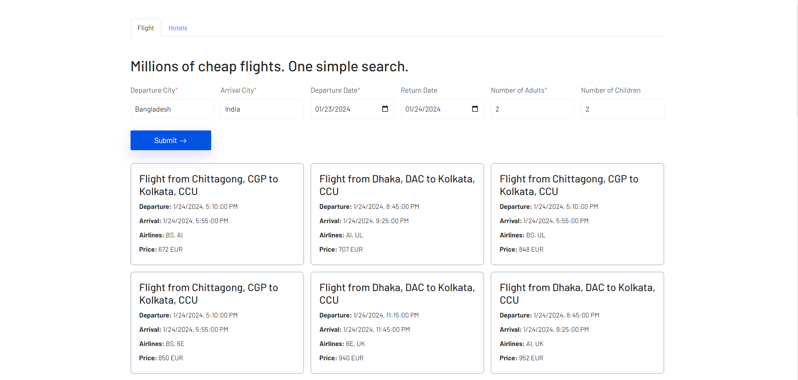

This is a [Next.js](https://nextjs.org/) project bootstrapped with [`create-next-app`](https://github.com/vercel/next.js/tree/canary/packages/create-next-app).

## Getting Started

First, run the development server:

```bash
npm run dev
# or
yarn dev
# or
pnpm dev
# or
bun dev
```

Open [http://localhost:3000](http://localhost:3000) with your browser to see the result.

You can start editing the page by modifying `app/page.js`. The page auto-updates as you edit the file.

This project uses [`next/font`](https://nextjs.org/docs/basic-features/font-optimization) to automatically optimize and load Inter, a custom Google Font.

# SETUP PROJECT ENV (prerequisite)

-   create a `.env` file from `.env.example` then update `NEXT_PUBLIC_API_BASE_URL` ,`NEXT_PUBLIC_API_KEY` with necessary data
-   [Get a valid api key from tequila](https://kiwicom.github.io/margarita/docs/guide-tequila-api-key)
-   [Get baseurl from your created app](https://tequila.kiwi.com/portal/docs/tequila_api/)

# DEMO IMAGE


